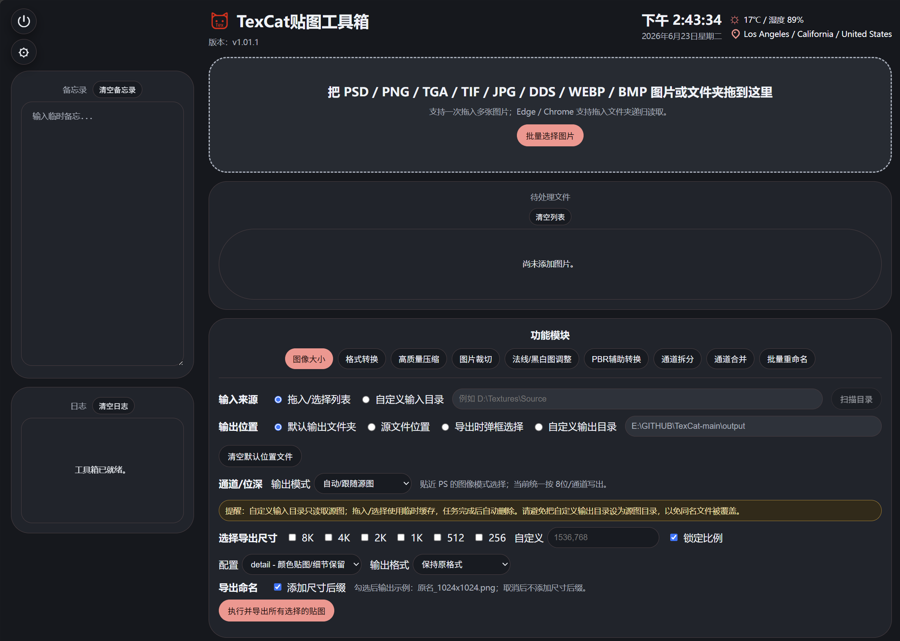
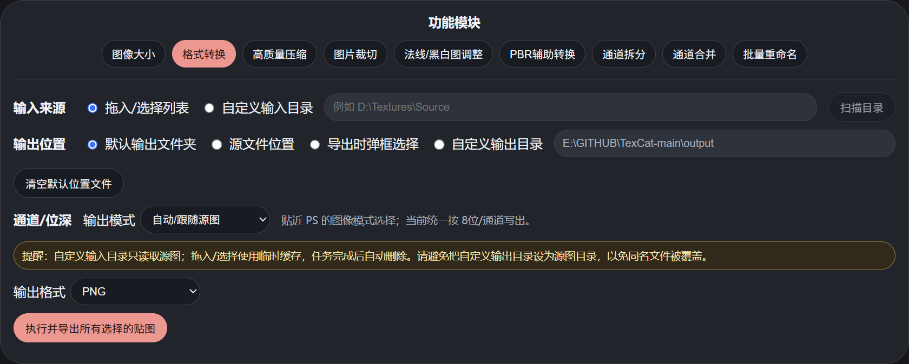
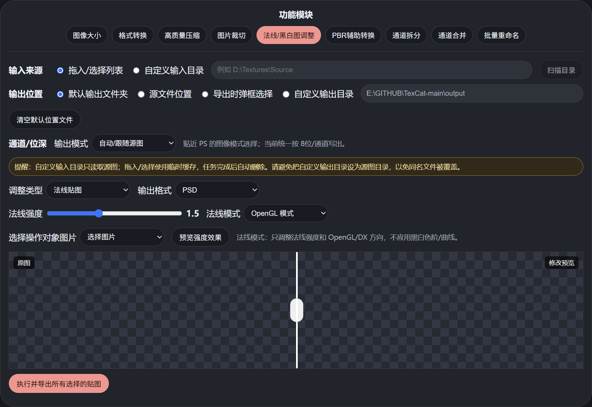
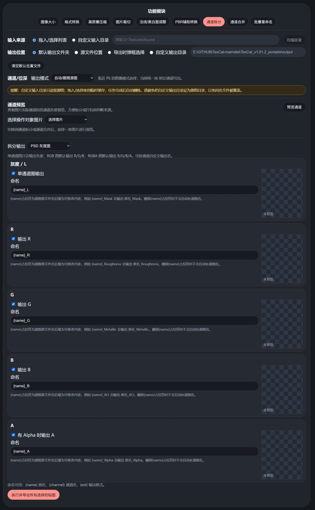
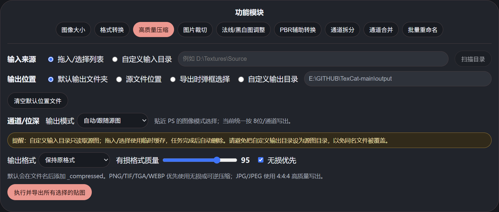
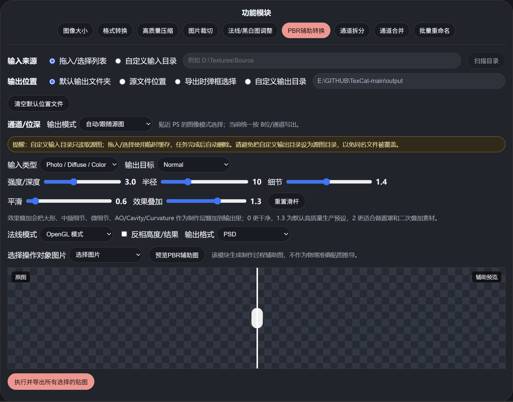
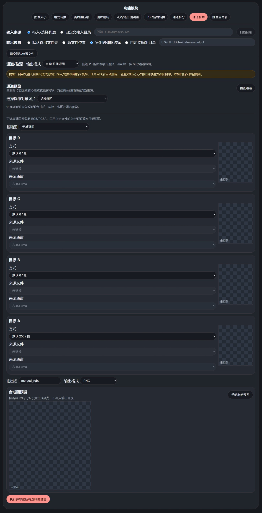
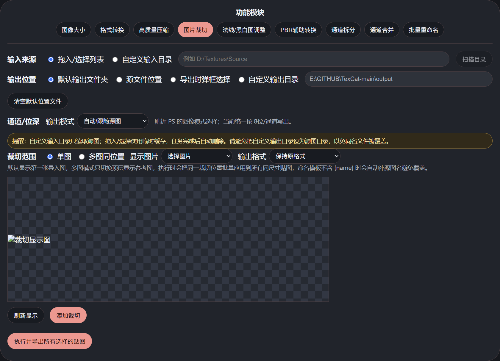
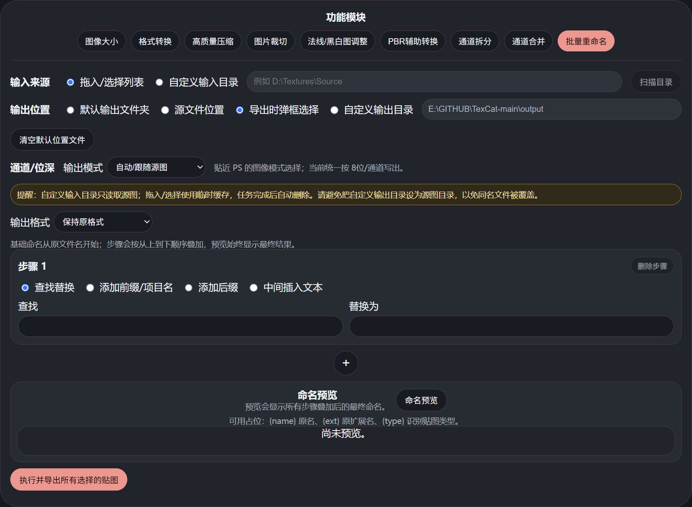

# TexCat / TexCat贴图工具箱

一个面向游戏贴图项目的本地浏览器工具箱。默认入口是网页拖拽界面，支持把图片或文件夹拖入页面后批量处理。

<p align="center">
  
</p>

## 界面预览

这些截图来自 TexCat 暗色主题，用于快速了解主要模块的界面布局。

<p align="center">
  
</p>

| 基础处理 | 材质辅助 | 通道与命名 |
| --- | --- | --- |
| <br>图像大小 | <br>法线/黑白图调整 | <br>通道拆分 |
| <br>高质量压缩 | <br>PBR辅助转换 | <br>通道合并 |
| <br>图片裁切 |  | <br>批量重命名 |

## 下载和启动

普通用户建议在 GitHub Releases 下载 `TexCat_版本号_portable.zip` 便携包。解压后直接双击 `TexCat.exe` 即可启动，不需要单独安装 Python。

`便携版使用说明.md` 是给便携包准备的日常使用说明；仓库里的 `README.md` 同时承担开源项目首页、源码运行和开发说明。

源码运行适合需要查看代码、二次开发或自行打包的用户，建议使用 Python 3.10 或更新版本。

```powershell
git clone https://github.com/mukemu1998/TexCat.git
cd TexCat
py -3 -m pip install -r requirements.txt
```

Windows 下源码方式也可以直接双击：

```text
启动TexCat.bat
```

也可以用命令行启动：

```powershell
py -3 src/texture_toolbox.py --web
```

开发时可用下面的命令跑当前回归测试：

```powershell
py -3 -m unittest discover -s tests -v
```

启动后浏览器会打开本地页面。关闭工具箱浏览器窗口后，后台本地服务会在心跳断开后自动退出；点击页面左上角的圆形电源图标 `退出工具箱` 会立即停止当前所有工具箱服务。电源图标下方的齿轮按钮可打开个性化设置，切换明暗模式、色系和 UI 圆角滑杆；默认主题为 `暗色 + 红 + 圆角 1.0`。左侧栏在空间足够时固定显示备忘录和日志，窗口过窄时自动移到页面下方；`清空日志` 只会清空当前页面日志，不影响待处理文件列表。`assets/TexCat.png` 用于网页图标，`assets/TexCat.ico` 用于以后 exe 打包或快捷方式图标。

当前开发分支增加了 `快速工具模式 / 工作流模式 Beta` 切换。工作流模式 Beta 目前支持资源池同步、步骤结构编辑、图片裁切/法线黑白调整/通道拆分/通道合并/缩放/格式压缩/命名规则的参数面板、保存/载入工作流 JSON、右侧当前步骤结果预览、输出文件名/路径/同名冲突预览，以及第一批内置工作流预设，并且已经可以真实执行一条更完整的工作流处理链。当前已接入执行的步骤包括：`图片裁切`、`法线 / 黑白图调整`、`通道拆分`、`通道合并 / 打包`、`缩放`、`格式与压缩`、`命名规则`，并且会按你在工作流里的步骤顺序真正处理图像；例如可以跑 `图片裁切 -> 法线/黑白调整 -> 通道拆分 -> 通道合并 -> 缩放 -> 格式与压缩 -> 命名规则 -> 导出`，也可以把顺序改成先缩放再拆分，或先拆出单通道后再重新打包。裁切步骤会复用图片裁切模块里已经框选好的裁切框、单图/多图同位置模式、命名模板和输出格式；法线/黑白调整步骤会复用当前快速工具模式里的法线模式、OpenGL/DX、强度、色阶、Gamma、曲线和输出格式；通道拆分步骤会复用当前拆分模块里的启用通道、命名模板和输出格式，并把每个通道作为后续步骤的独立输入继续往下走；通道合并步骤会从进入该步骤时的上游结果里读取可选来源，再决定基础图、R/G/B/A 通道来源、输出名和输出格式；右侧 `预览当前步骤结果` 会直接显示这一步之后的中间图缩略图、尺寸、模式和命名，步骤停用时也可以先预览启用后的效果。当前内置预设第一批包括：`多级尺寸输出`、`ORM 通道打包`、`法线批量调整`、`黑白遮罩调整`、`多图同位置裁切`、`通道拆分后重组`；可以直接替换当前工作流，也可以追加到现有步骤后继续编辑。现在还新增了 `工作流模板库`：可把当前流程直接保存到工具箱目录下的 `workflow_templates`，支持分类、备注、筛选，以及一键套用、追加或删除；步骤区也补上了 `全部启用 / 全部停用 / 仅启用当前 / 摘要折叠` 这类管理操作。源码版和后续打包版都会跟着保留这些模板。实际生产仍建议优先使用已经成熟的快速工具模式。当前这轮工作流推进先排除 `PBR辅助转换`，PBR 继续保留在快速工具模式中，等后续单独优化算法和默认预设后再考虑重新接入工作流。

顶部标题右侧的信息条会显示当前年月日、星期和 12 小时制时间；时间会按凌晨、早上、上午、中午、下午、傍晚、晚上、深夜细分显示。联网可用时会继续补充节日/法定节假日和当地天气；没有节日时不显示节日项，节日、温度和位置按同一纵向位置排版，位置使用简易尖角图钉图标。如果网络不可用或接口无法访问，天气和位置详情会自动隐藏，时间仍继续显示。左侧栏包含备忘录和日志，备忘录内容保存在当前浏览器本地，默认显示 20 行内容，超过 20 行后在内容框内滚动；可用 `清空备忘录` 一键清空。

## 发布打包

源码发布包可以直接双击：

```text
打包源码发布包.bat
```

脚本会读取 `VERSION`，要求 Git 工作区保持干净，然后从当前提交生成 `dist/TexCat_版本号_source.zip` 和对应的 `.sha256` 校验文件。这个包只包含仓库内已提交的源码、文档、图标和启动脚本，不包含 `.git`、缓存、临时上传目录或打包输出目录。

文档定位建议：

- `README.md`：用于 GitHub 项目首页、源码安装、开发说明和完整功能说明。
- `便携版使用说明.md`：用于打包版用户阅读，重点说明解压、双击启动、导入导出和常见注意事项。

## 输入和输出

- 输入来源可在界面中选择：`拖入/选择列表` 或 `自定义输入目录`。
- 拖入和批量选择的图片会进入一次性临时缓存，任务完成后自动清理，不会改动原文件。
- 自定义输入目录默认只读取源图，处理结果写到所选输出位置；只有主动选择 `源文件位置` 时，结果才会写回每张源图所在文件夹。
- 输出位置可在界面中选择：`默认输出文件夹`、`源文件位置`、`导出时弹框选择` 或 `自定义输出目录`。
- `源文件位置` 只适用于 `自定义输入目录`。单图/批量模块会把结果输出到每张源图所在文件夹；通道合并这类单输出任务会输出到基础图或首个通道来源所在文件夹。拖入/选择列表无法读取源图真实路径，因此不能使用该模式。
- 默认输出文件夹是工具箱目录下的 `output`；如果以后整合打包为 exe，则默认输出文件夹会自动变成 exe 同级目录下的 `output`。输出位置行末尾的 `清空默认位置文件` 会先确认，再只清空这个默认 `output` 文件夹里的内容，不影响源文件、自定义输出目录或源文件位置导出的文件。
- 如果把自定义输出目录设成源图目录，界面会提醒同名输出可能覆盖源文件，但不会强制阻止执行。
- 所有模块执行导出时都会先检查目标位置同名文件；如有冲突，界面会弹窗选择 `覆盖`、`取消` 或 `整体命名加_TC后缀`。
- 点击执行后，按钮下方会显示导出进度条和本次任务状态。

## 通道和位深

所有模块共用 `输出通道/位深` 选项：

- `自动/跟随源图`：尽量保持源图的常用生产模式，灰度保持灰度，RGB 保持 RGB，带透明通道的图保持 RGBA。
- `RGB 24位`：强制输出为 RGB，不带 Alpha。
- `RGBA 32位`：强制输出为 RGBA，适合需要透明通道的贴图。
- `灰度 8位`：强制输出为单通道灰度，适合遮罩、粗糙度、金属度等数据图。

当前工具箱统一按 `8位/通道` 写出。遇到 `16位/通道` 或 `32位/通道` 源图时，日志会提示会被转换。`JPG/JPEG` 不支持 Alpha，`BMP` 在当前运行时会丢弃 Alpha，`WEBP` 灰度图会被运行时写成 RGB 数据；这些情况都会在处理日志中提醒。

## 当前模块

- `图像大小`：高质量缩放，支持 `1K / 2K / 4K / 8K / 512 / 256` 和自定义尺寸；默认不预勾选尺寸，可选择是否在导出文件名中添加 `_1024x1024` 这类尺寸后缀；同时导出多个尺寸且关闭尺寸后缀时，会由同名检查提醒避免互相覆盖；可导入 16K 源图。
- `格式转换`：`PNG / TGA / TIF / TIFF / PSD / JPG / JPEG / DDS / WEBP / BMP` 互转。
- `高质量压缩`：支持单图或批量图片在不缩放的情况下重新写出压缩版本，默认输出 `_compressed` 文件名；PNG/TIF/TGA/WEBP 优先使用无损或可逆压缩，JPG/JPEG 使用 4:4:4 高质量参数尽量减少损失。
- `图片裁切`：支持单图自由框选裁切，也支持多张同尺寸贴图按同一位置批量裁切；裁切编辑模式会提示自由框选，可在框选后切换自由框选、`1:1` 锁定或自定义像素大小，并支持九宫格吸附对齐。多图同位置模式下，显示图只是顶层参考图，裁切卡片预览会跟随当前显示图切换，导出时同一裁切位置会批量应用到所有同尺寸贴图。批量裁切命名模板不含 `{name}` 时会自动补源图名避免覆盖。
- `法线/黑白图调整`：整合法线贴图强度和黑白/粗糙度贴图强度；法线可选 `OpenGL` 或 `DirectX / DX`，黑白图支持整体强度、灰度对比、粗糙倾向、色阶、Gamma、S 曲线、反相、滑杆重置和左右对比预览。
- `PBR辅助转换`：按 `Photo/Diffuse/Color`、`Normal Map`、`Height/Displacement` 输入类型生成 Normal、Derivative、Height、Displacement、AO、Cavity、Concavity、Convexity、Curvature 等制作过程辅助图。
- `通道拆分`：按输入图模式拆分通道，灰度图只输出 L，RGB 图输出 R/G/B，RGBA 图可输出 R/G/B/A，并支持每个通道自定义输出命名和通道预览。
- `通道合并`：支持基础图保留 RGB/RGBA，再用指定文件的指定通道替换目标 R/G/B/A；也支持多张单通道图直接打包成 RGB/RGBA，并可实时预览每个目标通道和合成图。
- `批量重命名`：使用步骤叠加式命名流程，支持查找替换、添加前缀/项目名、添加后缀、在两段文本之间插入内容、预览和冲突检测。

所有模块的输出格式都统一支持：`PSD / PNG / TGA / TIF / TIFF / JPG / JPEG / DDS / WEBP / BMP`。

本地桌面版的图像大小模块没有固定 4K 输入上限；可处理多大取决于当前电脑内存和 Pillow 能打开的源图。处理 8K/16K 源图时建议分批执行并关注内存占用。

## 支持格式

输入：

- `psd`
- `png`
- `tga`
- `tif` / `tiff`
- `jpg` / `jpeg`
- `dds`
- `webp`
- `bmp`

输出：

- `psd`
- `png`
- `tga`
- `tif` / `tiff`
- `jpg` / `jpeg`
- `dds`
- `webp`
- `bmp`

PSD 说明：输入 PSD 会读取当前合成图像；输出 PSD 是缩放后的扁平 PSD，不保留原始图层结构。

## 质量策略

- 格式转换模块不缩放、不锐化、不做颜色增强，只做解码后按目标格式重新保存。
- `PNG / TGA / TIF / TIFF / BMP / PSD`：按无损或扁平无损方式保存。
- `WEBP`：使用无损 WebP，并保留透明像素中的 RGB 信息。
- `JPG / JPEG`：使用 `quality=100` 和 `4:4:4` 采样，但 JPEG 格式本身仍然是有损格式，且不保留透明通道。
- `DDS`：使用当前 Pillow 运行时的默认未压缩 DDS 写出能力；适合格式互转检查，不等同于专门的 BC1/BC3/BC7 游戏贴图压缩导出。

## 重命名步骤

批量重命名从基础表达式 `{name}` 开始，并按步骤 1、步骤 2、步骤 3 依次叠加。当前步骤功能包括：

- `查找替换`：在 `{name}` 对应的原文件名里执行文本替换。
- `添加前缀/项目名`：在当前步骤处理后的文件名正文前面叠加前缀，不覆盖前面步骤的结果。
- `添加后缀`：在当前步骤处理后的文件名正文后面叠加后缀，不覆盖前面步骤的结果。
- `中间插入文本`：在文件名正文的两段文本之间插入新内容。例如 `hh-33_22_gg.tga` 的正文是 `hh-33_22_gg`，查找左侧文本填 `hh-33_`、查找右侧文本填 `22_gg`、中间插入文本填 `ooz`，结果为 `hh-33_ooz22_gg.tga`。

可用占位：

- `{name}`：原文件名，不含扩展名。
- `{ext}`：原扩展名，不含点。
- `{type}`：识别到的贴图类型关键词，例如 `Normal`、`AO`、`Roughness`。

命名预览始终显示所有步骤叠加后的最终结果；正式执行时同名文件处理沿用全模块统一规则：覆盖、取消，或本次整体命名加 `_TC` 后缀。

通道拆分的每个通道也支持自定义命名模板：

- `{name}`：原文件名，不含扩展名。
- `{channel}`：当前输出通道，例如 `R`、`G`、`B`、`A`、`L`。
- `{ext}`：输出格式。

示例：

```text
{name}_{channel}
```

`Packed.png` 拆分 R 通道会输出为：

```text
Packed_R.png
```

通道拆分中 `{name}` 占位符为源图原文件名，后缀为可修改内容，例如 `{name}_Mask` 会输出 `原名_Mask`。删掉 `{name}` 占位符时不会自动补源图名；模板写成 `Mask` 时会直接输出 `Mask.ext`。

图片裁切的命名模板也支持 `{name}` 和 `{index}`；`{name}` 占位符为源图原文件名。多图同位置裁切时，如果模板缺少 `{name}`，工具会自动补源图名，避免多张同格式图片互相覆盖。裁切编辑器中，`1:1` 锁定支持保持正方形拖拽缩放；自定义像素模式按输入宽高生成固定裁切框，只能移动或用九宫格吸附定位。

`{type}` 会识别常见贴图类型关键词，例如 `Normal / AO / Roughness / Metallic / BaseColor / Height / Cavity / Opacity / Emissive / Specular / Glossiness` 以及部分中文关键词。

## 通道打包

通道合并模块支持这些生产流程：

- 单通道图打包：例如 `R=AO`、`G=Roughness`、`B=Metallic`、`A=Mask`。
- RGB 图补 Alpha：选择基础图保留 R/G/B，再把单通道图写入 A。
- RGB/RGBA 通道替换：保留基础图的一部分通道，用其他图片的 `R/G/B/A/灰度` 替换指定目标通道。

来源通道选择 `灰度/Luma` 时，会按 RGB 亮度计算灰度；选择 `R/G/B/A` 时，会直接取对应通道。来源图没有 Alpha 时选择 A，会使用全白 255。

通道拆分和通道合并模块带有 `通道预览`：

- 可直接查看所选图片的尺寸、图像模式、是否有 Alpha、实际通道。
- 会显示原图、灰度/Luma、R/G/B/A 的缩略预览和通道数值范围。
- 支持拖入/选择列表，也支持自定义输入目录。
- 预览只读取图片并生成临时缩略图，不会写输出目录，也不会修改源文件。

通道合并模块会在每个目标通道卡片右侧显示当前通道预览；选择基础图时会自动把目标 R/G/B/A 设置为保留基础图对应通道，之后仍可手动改成默认值或指定来源图通道。合成预览会随设置变化自动刷新，也可以点击 `手动刷新预览` 立即重新生成。

## 法线/黑白图调整

法线/黑白图调整模块内可切换 `法线贴图` 和 `黑白 / 粗糙度贴图`。

- 法线贴图模式：使用滑杆控制强度，模式选择 `OpenGL` 时保持 G 通道方向，选择 `DirectX / DX` 时会翻转 G 通道。
- 黑白 / 粗糙度模式：输出灰度 8位贴图，支持整体强度、灰度对比、粗糙倾向、黑场、白场、中间调 Gamma、S 曲线和反相。
- 黑白图的色阶和曲线参数只作用于黑白 / 粗糙度模式，不会应用到法线模式。

选择操作对象图片后点击 `预览强度效果`，界面会显示左右对比预览：左侧为原图，右侧为修改后效果，中间分割线可以左右拖拽调整对比范围。

## PBR辅助

`PBR辅助转换` 定位为制作过程辅助图生成，不宣称完全复刻 Knald 的专有算法，也不宣称从法线物理准确推导最终金属度或完整材质。当前按 Knald 风格的转换链路组织：

- `Photo / Diffuse / Color` 输入：可生成 Normal、Derivative、Height、Displacement、AO、Cavity、Concavity、Convexity、Curvature。
- `Normal Map` 输入：可近似恢复 Height，并继续生成 AO、Cavity、Concavity、Convexity、Curvature。
- `Height / Displacement` 输入：可生成 Normal、Derivative、AO、Cavity、Concavity、Convexity、Curvature。

参数包括强度/深度、半径、细节、平滑、效果叠加、OpenGL/DX 和反相。当前默认值就是高质量生产预设：强度 3.0、半径 10、细节 1.4、平滑 0.6、效果叠加 1.3。`效果叠加` 为生产层叠加控制：0 更接近干净转换，1.3 是默认高质量制作强度，2 会更强调 Cavity/AO/Curvature 与微细节，适合输出后继续叠加成遮罩或细节素材。

## 技术说明

- 主入口是 [texture_toolbox.py](src/texture_toolbox.py)。
- [texture_resizer.py](src/texture_resizer.py) 保留为图像大小模块的核心实现。
- 默认使用浏览器拖放入口，避免 Tk 窗口在部分 Windows 环境中拖入文件时闪退。

## 分支和版本

- `main`：稳定版本，适合普通使用者下载。
- `dev/v1.02`：开发版本，包含工作流模式 Beta 等仍在迭代的功能。
- 稳定回滚点会用 Git tag 标记，例如 `v1.01`。

## 开源许可

TexCat 使用 [MIT License](LICENSE) 开源。你可以自由使用、修改和分发；如果把修改版继续发布，请保留许可证文本和版权声明。
